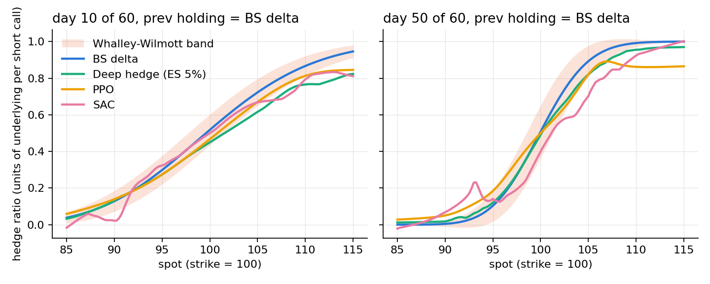
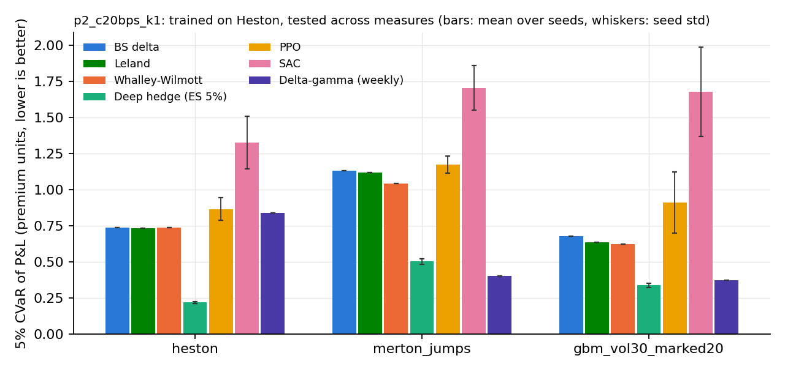

# hedgerl: RL and classical hedging of a short index option book under transaction costs

A dealer is structurally short options from customer flow and has to hedge them under transaction
costs. This repo asks a narrow question with careful controls: **does a learned hedging policy beat
the cost-aware practitioner baselines (Whalley-Wilmott bands, Leland's adjusted delta), on the same
paths, and does the edge survive when the market does not follow the model it was trained on?**

Everything runs on a laptop CPU: about 40 minutes for seed 0 (`./run_all.sh`), another 20 on 8 cores for seeds 1 and 2 (`run_seeds.sh`).

## What is in here

| Piece | Where it comes from |
|---|---|
| Market simulators: Heston (Andersen QE), rough Bergomi, Merton jumps, GBM | `pfhedge.stochastic`, wrapped in `hedgerl/sim.py` with seeding and a "marking vol" the hedger believes |
| Option book accounting, Black-Scholes marking and Greeks | `hedgerl/book.py`, `hedgerl/pricing.py` (own code, unit tested) |
| Gymnasium environment (SB3 compatible) and a vectorised paired-path evaluator that share the same accounting | `hedgerl/env.py` |
| Baselines: BS delta, Leland (1985), Whalley-Wilmott (1997) band, weekly delta-gamma, unhedged | `hedgerl/baselines.py` |
| Deep hedging baseline (Buehler et al. 2019): policy net trained end to end on 5% expected shortfall | `hedgerl/deephedge.py`, loss from `pfhedge.nn.ExpectedShortfall` |
| RL agents: PPO and SAC with a Kolm-Ritter (2019) per-step mean-variance reward | `stable-baselines3`, `scripts/train_rl.py` |
| Evaluation: 20,000 identical test paths per measure, CVaR, turnover, paired-bootstrap CIs vs Whalley-Wilmott | `hedgerl/evaluate.py` |

Two problems, selected by `--phase`:

- **Phase 1**: short one 60-day ATM call, hedge with the underlying. The saturated textbook setup, kept as the control.
- **Phase 2**: short a 60-day ATM straddle, hedge with the underlying **and** a 90-day ATM call (bid-ask spread on the option). This is the delta-gamma problem a dealer actually has.

Costs: 20 bps proportional on the underlying, 1% of premium on the hedge option. State: log-moneyness,
time to expiry, marking vol, previous holdings, and the book's Black-Scholes delta and gamma (the agent
is allowed to know the textbook hedge; the question is whether it learns to deviate from it usefully).
Reward for SB3 agents is $r_t = \delta w_t - \frac{\kappa}{2}\,\delta w_t^2$ with $\delta w_t$ scaled by the initial premium.

## Results (P&L in units of the initial premium, 20,000 paired paths, trained on Heston)

Marking convention for the misspecification tests: the *market* prices options correctly under the
true test model (Black-Scholes at the true 30% vol for the GBM test, the exact Merton jump-diffusion
price for the jump test), while the *hedger* computes Greeks at the 20% it believes. So the hedger
is wrong, the market is not, and nobody can earn P&L by trading a mispriced hedge option.

**Phase 1, short call, underlying only.** 5% CVaR (lower is better). Learned policies: mean over three
training seeds, with the standard deviation across seeds in parentheses. "3/3" means every seed's
paired-bootstrap 95% CI for the CVaR difference vs Whalley-Wilmott lies below zero.

| policy | Heston | rough Bergomi | Merton jumps | GBM, true vol 30% marked 20% |
|---|---|---|---|---|
| BS delta (cost-blind) | 0.760 | 0.876 | 1.134 | 0.700 |
| Leland | 0.754 | 0.872 | 1.117 | 0.656 |
| Whalley-Wilmott | 0.766 | 0.781 | 1.034 | 0.654 |
| Deep hedge, ES 5% | **0.663** (0.002), 3/3 | **0.626** (0.014), 3/3 | **1.009** (0.006), 3/3 | **0.551** (0.011), 3/3 |
| PPO, $\kappa = 1$, 500k steps | 0.900 (0.035), 0/3 | 0.725 (0.022), 2/3 | 1.231 (0.039), 0/3 | 0.945 (0.111), 0/3 |
| SAC, $\kappa = 1$, 200k steps | 1.037 (0.067), 0/3 | 0.917 (0.098), 0/3 | 1.281 (0.110), 0/3 | 1.015 (0.135), 0/3 |

**Phase 2, short straddle, underlying plus a 90-day hedge option.** The rough Bergomi column is
omitted here on purpose: there is no closed-form option price under rough volatility, so the hedge
option would be marked with a model that is not the market's and the option-leg P&L would be a
marking artefact rather than hedging skill. It is kept in `results/p2_c20bps_k1/summary.md` with that warning.

| policy | Heston | Merton jumps | GBM, true vol 30% marked 20% |
|---|---|---|---|
| BS delta | 0.739 | 1.134 | 0.679 |
| Whalley-Wilmott | 0.738 | 1.045 | 0.623 |
| Delta-gamma, weekly | 0.841 | **0.403** | 0.373 |
| Deep hedge, ES 5% | **0.219** (0.006), 3/3 | 0.502 (0.018), 3/3 | **0.338** (0.015), 3/3 |
| PPO, $\kappa = 1$ | 0.867 (0.078), 0/3 | 1.173 (0.060), 0/3 | 0.912 (0.211), 0/3 |
| SAC, $\kappa = 1$ | 1.326 (0.183), 0/3 | 1.706 (0.154), 0/3 | 1.680 (0.310), 0/3 |

Full per-seed tables with mean, std, 1% CVaR, turnover, cost paid and bootstrap intervals: `results/*/summary.md`; seed aggregates in `results/*/seeds_*.csv`.





## What the numbers say

1. **Cost-blind delta is the wrong baseline.** At 20 bps, Whalley-Wilmott pays half the transaction cost of daily delta hedging for the same or better tail. Any "RL beats Black-Scholes" claim that compares against BS delta alone is comparing against a strawman.
2. **Direct policy optimisation (deep hedging) beats Whalley-Wilmott on tail risk** by 13% on Heston in Phase 1, by 20% under rough volatility and 16% under a 50% vol misspecification, on every one of three training seeds, with seed-to-seed spread an order of magnitude smaller than the effect. Under jumps the edge is small (1.009 vs 1.034): a stock-only hedge cannot do much about jumps and the learned policy does not pretend otherwise. The policy under-hedges in the money (the "delta haircut" in the figure) and trades less than delta.
3. **Neither PPO (500k steps) nor SAC (200k steps) beats Whalley-Wilmott on any seed** (one exception: two of three PPO seeds under rough vol in Phase 1). Their seed-to-seed spread is 5 to 20 times larger than deep hedging's, i.e. they are not just worse, they are unstable. SAC is worse than cost-blind delta. A $\kappa = 20$ PPO variant (single seed, `results/p1_c20bps_k20`) does not change this. This matches Neagu et al. (2025), who found that among eight DRL algorithms only Monte Carlo policy gradient reliably beat delta hedging under a training budget. A clean negative result with a proper baseline is the point.
4. **Hedging with options is where the tail risk actually goes.** In Phase 2 the deep hedger cuts 5% CVaR from 0.74 (best classical) to 0.22 on Heston, on all three seeds. Under jumps the weekly delta-gamma rebalance is the best policy (0.40 vs 0.50), which is what a gamma hedge is for and the deep hedger, trained on a diffusion, never saw a jump. Under a 50% vol misspecification the deep hedger still wins (0.34 vs 0.37).
5. **Weekly delta-gamma is worse than delta-only on Heston** (0.84 vs 0.74) because the longer-dated hedge option over-hedges vega. Gamma hedging with the wrong tenor is not free.

Known limitations: three seeds is the minimum credible number, not a large sample; Heston parameters
are typical SPX-like values, not calibrated to a surface; the rough Bergomi test is only reliable for
the stock-only book; no real market data yet.

## Reproduce

```
pip install -e .[dev]
pytest -q                      # 13 tests: BS Greeks vs finite differences, env == vectorised rollout,
                               # P&L identity, torch == numpy accounting, Merton pricer vs Monte Carlo
./run_all.sh                   # seed 0: trains and evaluates both phases, writes results/
NPROC=8 ./run_seeds.sh         # seeds 1 and 2 for every learned policy, then re-evaluates with seed aggregates
```

Individual steps:

```
python scripts/train_deephedge.py --phase 1 --cost 0.002
python scripts/train_rl.py --algo ppo --phase 1 --cost 0.002 --steps 500000 --kappa 1
python scripts/run_eval.py --phase 1 --cost 0.002 --kappa 1
python scripts/make_figures.py --phase 1 --cost 0.002 --kappa 1
```

## Design decisions worth defending

- One accounting function feeds the gym env, the vectorised evaluator and the differentiable deep-hedging loss; a test asserts all three agree to 1e-6. Nobody gets a different P&L convention.
- All policies see the same paths (fixed seeds), so differences are paired and the bootstrap resamples paths, not P&Ls.
- Two vols are kept apart: the market's pricing vol (option values) and the hedger's marking vol (Greeks). Baselines and agents read the same Greeks, so under misspecification everyone is equally wrong and nobody trades a mispriced option.
- Positions are closed at cost at expiry; the premium enters through $-q(V_T - V_0)$; $r = 0$.
- Heston parameters are typical SPX-like values ($\kappa = 2$, $\theta = 0.04$, $\xi = 0.5$, $\rho = -0.7$), not calibrated to a surface. Calibration is a two-hour add-on and does not change any conclusion above.

## Next

- Real out-of-sample test on SPY end-of-day option chains (Kaggle 2020 to 2022): open a short ATM call each Monday, mark to actual mids, hedge at actual closes.
- A Monte Carlo (or approximate) option pricer under rough Bergomi so the Phase 2 rough-vol column can be reported.
- Cost sweep at 0, 5, 10, 50 bps to locate the crossover where learned policies stop mattering.
- Distributional critic (QR-SAC) with a CVaR objective, the Cao et al. (2023) lineage.

## References

Buehler, Gonon, Teichmann, Wood (2019) Deep Hedging, *Quantitative Finance*. Kolm, Ritter (2019) Dynamic Replication and Hedging: A Reinforcement Learning Approach, *JFDS*. Cao, Chen, Hull, Poulos (2021) Deep Hedging of Derivatives Using RL, *JFDS*. Cao et al. (2023) Gamma and Vega Hedging Using Deep Distributional RL, *Frontiers in AI*. Neagu, Godin, Kosseim (2025) Deep RL Algorithms for Option Hedging, arXiv 2504.05521. François, Gauthier, Godin, Pérez-Mendoza (2025) Deep Hedging with Options Using the Implied Volatility Surface, arXiv 2504.06208. Whalley, Wilmott (1997) An asymptotic analysis of an optimal hedging model for option pricing with transaction costs. Leland (1985) Option pricing and replication with transactions costs. pfhedge: Preferred Networks, github.com/pfnet-research/pfhedge.
